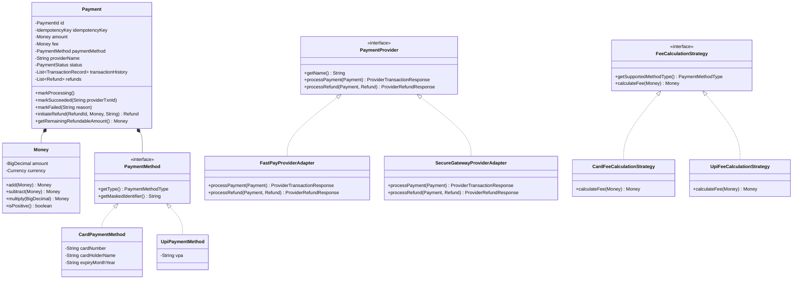

# Class Diagram: Payment Processing Engine

```mermaid
classDiagram
    class Payment {
        -PaymentId id
        -IdempotencyKey idempotencyKey
        -Money amount
        -Money fee
        -PaymentMethod paymentMethod
        -String providerName
        -PaymentStatus status
        -List~TransactionRecord~ transactionHistory
        -List~Refund~ refunds
        +markProcessing()
        +markSucceeded(String providerTxnId)
        +markFailed(String reason)
        +initiateRefund(RefundId, Money, String) Refund
        +getRemainingRefundableAmount() Money
    }

    class Money {
        -BigDecimal amount
        -Currency currency
        +add(Money) Money
        +subtract(Money) Money
        +multiply(BigDecimal) Money
        +isPositive() boolean
    }

    class PaymentMethod {
        <<interface>>
        +getType() PaymentMethodType
        +getMaskedIdentifier() String
    }

    class CardPaymentMethod {
        -String cardNumber
        -String cardHolderName
        -String expiryMonthYear
    }

    class UpiPaymentMethod {
        -String vpa
    }

    class PaymentProvider {
        <<interface>>
        +getName() String
        +processPayment(Payment) ProviderTransactionResponse
        +processRefund(Payment, Refund) ProviderRefundResponse
    }

    class FastPayProviderAdapter {
        +processPayment(Payment) ProviderTransactionResponse
        +processRefund(Payment, Refund) ProviderRefundResponse
    }

    class SecureGatewayProviderAdapter {
        +processPayment(Payment) ProviderTransactionResponse
        +processRefund(Payment, Refund) ProviderRefundResponse
    }

    class FeeCalculationStrategy {
        <<interface>>
        +getSupportedMethodType() PaymentMethodType
        +calculateFee(Money) Money
    }

    class CardFeeCalculationStrategy {
        +calculateFee(Money) Money
    }

    class UpiFeeCalculationStrategy {
        +calculateFee(Money) Money
    }

    PaymentMethod <|.. CardPaymentMethod
    PaymentMethod <|.. UpiPaymentMethod
    PaymentProvider <|.. FastPayProviderAdapter
    PaymentProvider <|.. SecureGatewayProviderAdapter
    FeeCalculationStrategy <|.. CardFeeCalculationStrategy
    FeeCalculationStrategy <|.. UpiFeeCalculationStrategy
    Payment *-- Money
    Payment *-- PaymentMethod
```
