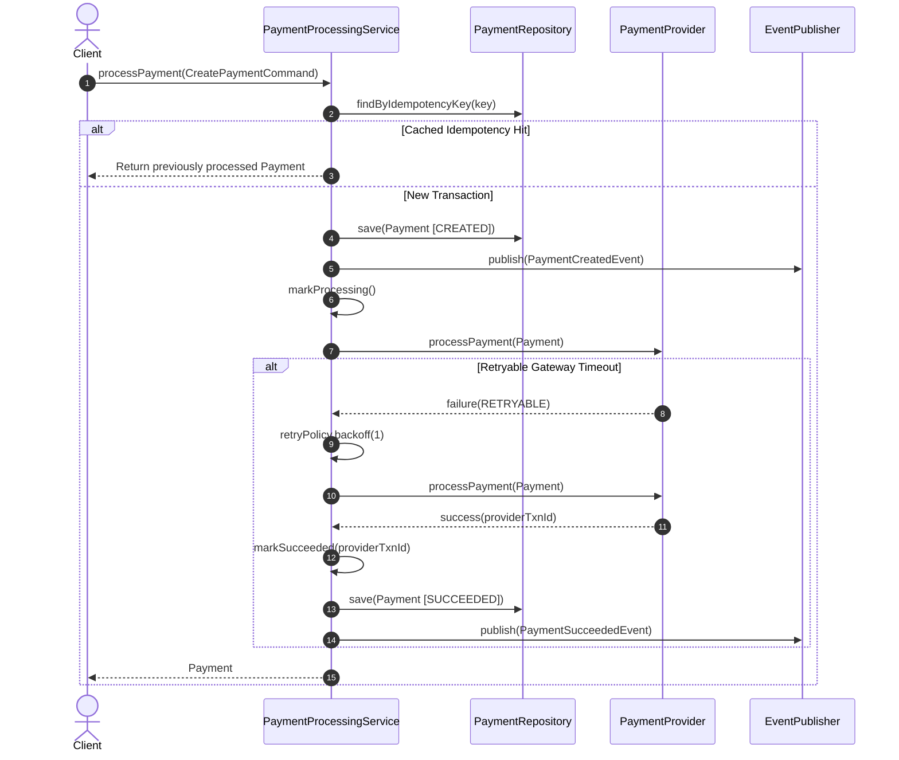
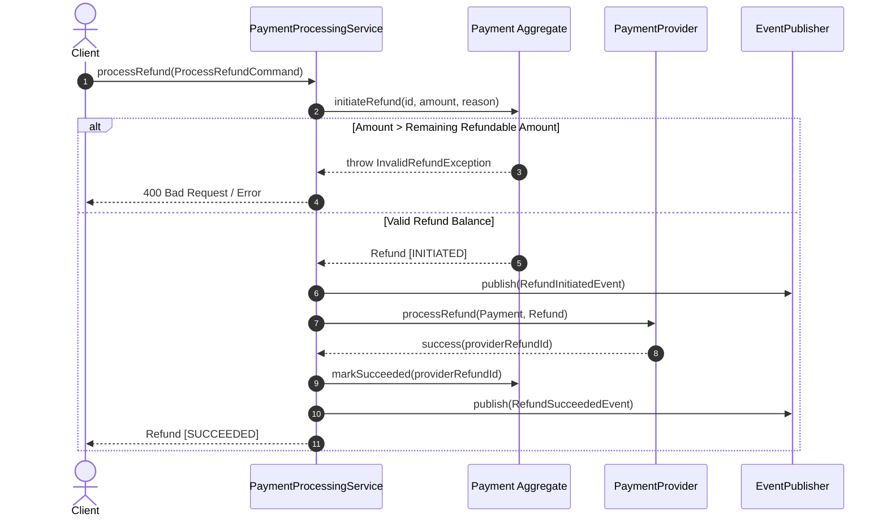

# Sequence Diagrams: Payment Processing Engine

## 1. Idempotent Payment Flow with Exponential Backoff Retries

```mermaid
sequenceDiagram
    autonumber
    actor Client
    participant Service as PaymentProcessingService
    participant Repo as PaymentRepository
    participant Provider as PaymentProvider
    participant Events as EventPublisher

    Client->>Service: processPayment(CreatePaymentCommand)
    Service->>Repo: findByIdempotencyKey(key)
    alt Cached Idempotency Hit
        Service-->>Client: Return previously processed Payment
    else New Transaction
        Service->>Repo: save(Payment [CREATED])
        Service->>Events: publish(PaymentCreatedEvent)
        Service->>Service: markProcessing()
        Service->>Provider: processPayment(Payment)
        alt Retryable Gateway Timeout
            Provider-->>Service: failure(RETRYABLE)
            Service->>Service: retryPolicy.backoff(1)
            Service->>Provider: processPayment(Payment)
            Provider-->>Service: success(providerTxnId)
            Service->>Service: markSucceeded(providerTxnId)
            Service->>Repo: save(Payment [SUCCEEDED])
            Service->>Events: publish(PaymentSucceededEvent)
        end
        Service-->>Client: Payment
    end
```

## 2. Refund Workflow with Balance Check

```mermaid
sequenceDiagram
    autonumber
    actor Client
    participant Service as PaymentProcessingService
    participant Payment as Payment Aggregate
    participant Provider as PaymentProvider
    participant Events as EventPublisher

    Client->>Service: processRefund(ProcessRefundCommand)
    Service->>Payment: initiateRefund(id, amount, reason)
    alt Amount > Remaining Refundable Amount
        Payment-->>Service: throw InvalidRefundException
        Service-->>Client: 400 Bad Request / Error
    else Valid Refund Balance
        Payment-->>Service: Refund [INITIATED]
        Service->>Events: publish(RefundInitiatedEvent)
        Service->>Provider: processRefund(Payment, Refund)
        Provider-->>Service: success(providerRefundId)
        Service->>Payment: markSucceeded(providerRefundId)
        Service->>Events: publish(RefundSucceededEvent)
        Service-->>Client: Refund [SUCCEEDED]
    end
```
